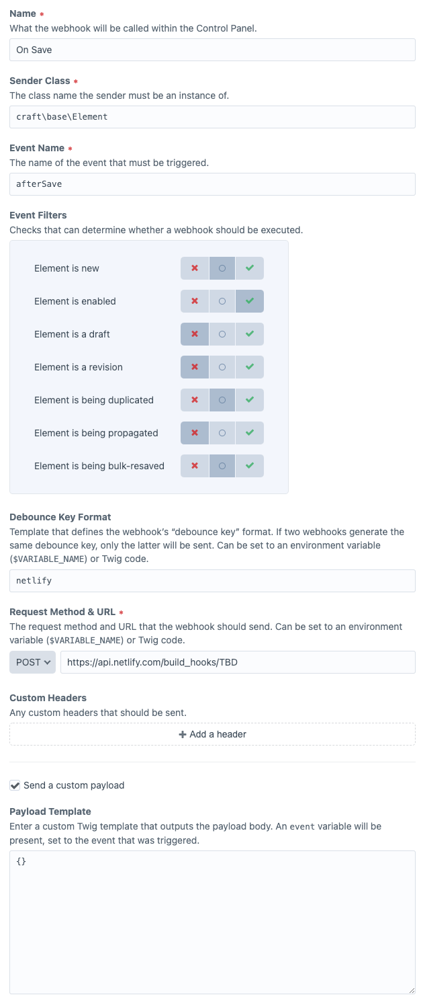
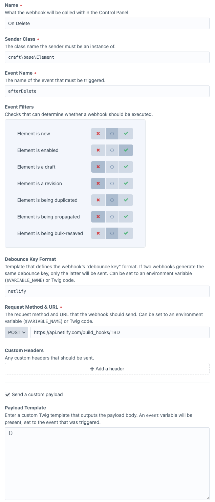

# Craft CMS - Configuration - Webhooks

[Until webhooks are storeable in project config or exportable](https://github.com/craftcms/webhooks/issues/24), they need to be recreated everytime.

## Netlify

Create 2 webhooks exactly as described here below.  These suggestions come [from this thread](https://github.com/craftcms/webhooks/issues/29#issuecomment-646288943).

### On save

### On delete

